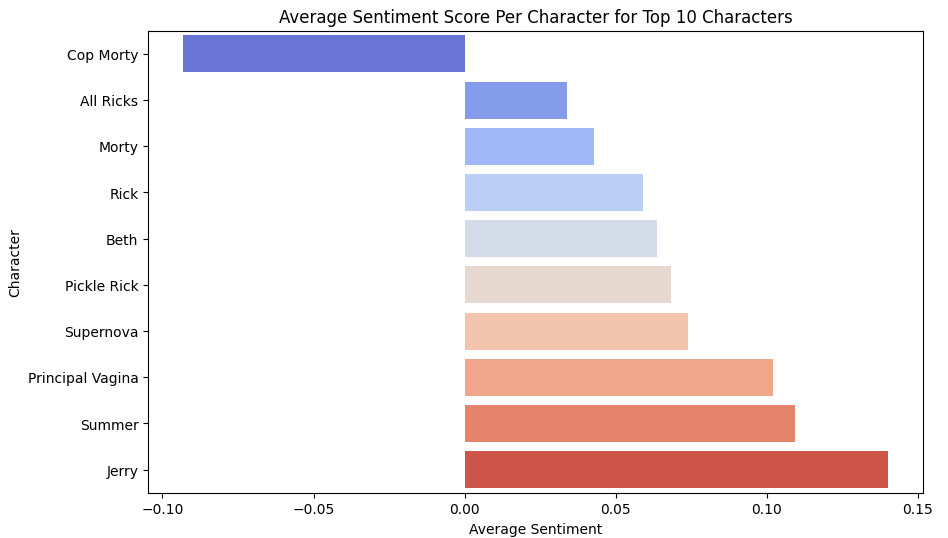
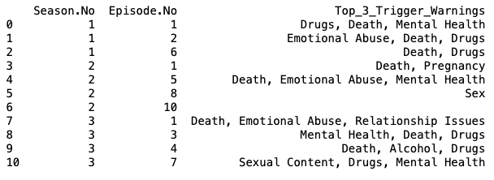
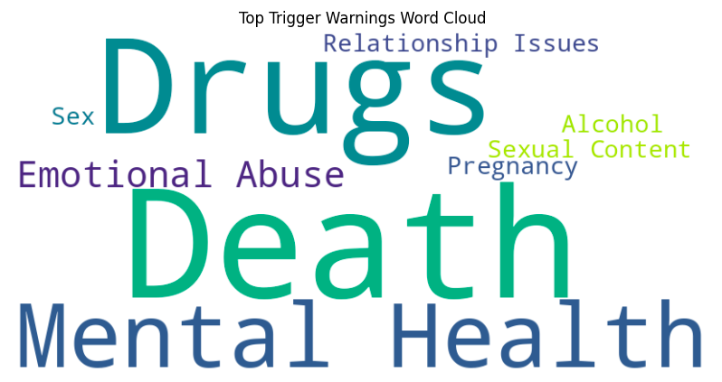

# Comedy Insights: Multi-Show Analysis

## Project Overview
This project uses natural language processing techniques to analyze scripts from popular comedy TV shows. The goal is to derive insights by identifying themes, sentiment scores, and trigger warnings across episodes. The primary focus has been on "Rick and Morty," but similar methodologies have been applied to the following shows:
- Friends
- The Office
- How I Met Your Mother
- The Big Bang Theory

## Features
- **Text Cleaning and Preprocessing:** Standardizing text data to ensure consistency and accuracy in analysis.
- **Sentiment Analysis:** Evaluating the emotional tone of dialogues to understand character sentiments.
- **Trigger Warning Identification:** Detecting sensitive themes that might require viewer discretion.
- **Topic Modeling:** Discovering prevalent themes and topics using Latent Dirichlet Allocation (LDA).
- **Visualization:** Creating charts and word clouds to visually summarize the analysis results.

## Prerequisites
To run this project, install the following Python packages:
- pandas
- numpy
- matplotlib
- seaborn
- nltk
- scikit-learn
- spacy
- wordcloud

## Analysis Results

### "Rick and Morty" Insights

#### Sentiment Analysis
Below is a bar chart showing the average sentiment scores for the top 10 characters in "Rick and Morty":

#### Episode Trigger Warnings
This table highlights the top 3 trigger warnings identified in various "Rick and Morty" episodes:

#### Trigger Warning Word Cloud
The word cloud below illustrates the frequency of various trigger warnings mentioned across the episodes analyzed:

